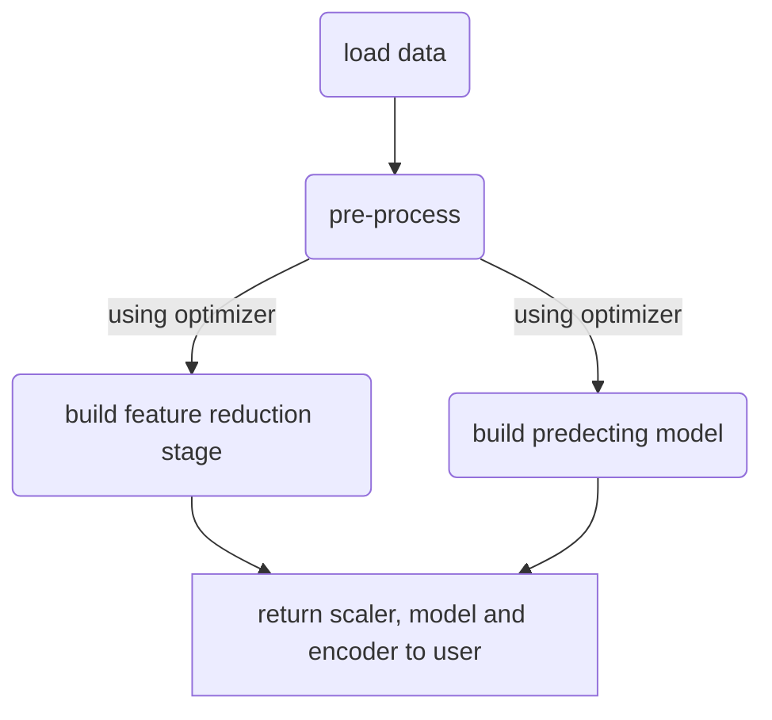

# NeuralAutoDesigner (auto_design)

## What is it for 
This is the repository containing the POC for automatically designing an end to end machine learning pipeline using **differential** and **non-differential** optimization techniques. This was implemented using Keras (with a Tensorflow backend) and genetic algorithims. The pipeline includes the following steps for now :
- Data preprocessing stage
- Feature reduction stage
- Modeling

## Current machine learning models supported
Feature reduction:
- auto encoders
Modeling:
- feed forward nets

## Optimizer used
The auto_designer optimizes the ML pipeline using **genetic algorithims**  

## Types of problems that can be solved using auto_design
The auto_design supports two types of supervised machine learning problems for now:
- Regression
- Binary classifications

## Flowchart of auto designing process end to end

